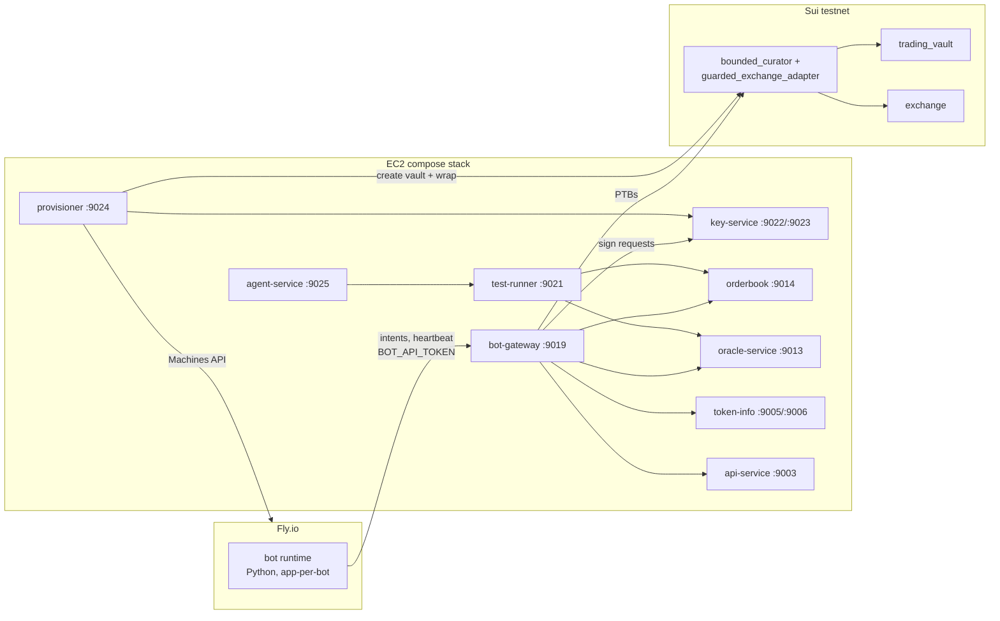

# Curator Studio — Implementation Guide

Companion to [`docs/curator-studio-spec.md`](../curator-studio-spec.md) (v1.1). The spec says *what*; this guide says *how*, grounded in the actual repo. Every file path, port, and convention below was verified against the working tree on 2026-08-12.

## Chapters

| # | File | Phase | Contents |
|---|---|---|---|
| 00 | this file | — | Architecture recap, spec deltas found during repo mapping, conventions cheat sheet |
| 01 | [01-guard-contracts.md](01-guard-contracts.md) | P0 | `bounded-curator` Move package, guarded exchange adapter, limiter, publish-pipeline wiring, validation drills |
| 02 | [02-bot-gateway.md](02-bot-gateway.md) | P1 | The gateway service: API, order path, salt discipline, risk tier, PTB submission |
| 03 | [03-key-service.md](03-key-service.md) | P1 | KMS envelope keys, server-side signing, export flow, audit log |
| 04 | [04-provisioner-and-fly.md](04-provisioner-and-fly.md) | P1 | Deploy orchestration, gas funding, Fly Machines integration, bot runtime image |
| 05 | [05-python-sdk.md](05-python-sdk.md) | P1 | `curator-sdk` Python package + template bot |
| 06 | [06-test-runner.md](06-test-runner.md) | P2 | T1/T2 simulation service, data plane, report artifacts |
| 07 | [07-dashboard-and-agent.md](07-dashboard-and-agent.md) | P3 | Dashboard surfaces, agent service (opencode + OpenRouter), consent records |
| 08 | [08-power-user-and-marketplace.md](08-power-user-and-marketplace.md) | P4–P5 | Bespoke code pipeline, export, BYO agent, marketplace |
| 09 | [09-deploy-checklists.md](09-deploy-checklists.md) | all | Per-service instantiation of the house new-service checklist, secrets, monitoring, alert ids |

## Architecture (implementation view)

New backend services live in the **existing EC2 compose stack** and follow every house pattern (chapter 09). Only the per-user bot runtimes and the ephemeral agent build sandboxes run on Fly.io.

## Spec deltas discovered during repo mapping

These override the corresponding spec sections. The spec was written before the code was mapped; the code wins.

1. **Spec §6.2 (core refactor) is already satisfied — P0 shrinks.** There are *zero* `entry fun`s in `contracts/`; every curator function is `public fun` taking `cap: &CuratorCap`; the single authority check is `assert_current_cap` (`contracts/trading-vault/sources/vault.move:1546`), which compares object ids, never tx senders; and `CuratorCap has key, store` (`vault.move:201`) so a wrapper can own it. **No core-package changes are required to wrap the cap.** P0 is purely additive.

2. **`rotate_curator_by_curator` is the guard's one escape hatch.** `vault.move:1509` lets the current cap mint a *fresh* cap to any recipient (the old one is disowned in place). If the guard mirrored it, the bot could rotate authority out of the wrapper. The guard must **not** mirror it for the curator; rotation is exposed only on the guard's `OwnerCap` (which is also how revoke/export-handoff works). See 01 §4.

3. **The vault has no per-vault owner cap — the guard mints its own.** The only caps today are the *global* `options_core::admin::AdminCap` and the per-vault `CuratorCap` (`create_vault`, `vault.move:271`, mints exactly one cap to the sender). The spec's `OwnerCap` is therefore a `bounded_curator::OwnerCap` minted at wrap time and transferred to the user's wallet. Unwrap/rotate/policy-change are guard-package functions gated on it.

4. **Exchange band enforcement happens at fill time, not order placement.** There is no on-chain `place_order`: hybrid-exchange orders are signed off-chain (domain `b"SUI_HYBRID_EXCHANGE_ORDER"`, digest over `(order, registry_id)`) and filled permissionlessly through quote-session adapters. The enforcement design is therefore: the vault opts into a **guarded fork of `exchange_adapter`** (its own witness type) instead of the stock one, and that adapter enforces price band + notional against a shared per-vault `VaultLimiter` object inside `fill_vault_order`/`match_*`. Since `vault::add_quote_adapter` is cap-gated and the cap is inside the guard, the guard controls which adapters can ever open take-capable quote sessions. DeepBook calls, by contrast, *are* cap-gated on-chain and get banded directly in the guard's mirrors. See 01 §3.

5. **T1's historical-price data plane has a gap.** price-charting (the TimescaleDB bar store) is currently undeclared in staging compose because the staging Tiger Data instance has been paused since 2026-07-15 — no spot history is being collected. T1 needs either the Tiger instance resumed + backfill, or (recommended, more regimes) a one-off bulk import of external SUI/USD candles into the test-runner's own DB. See 06 §2.

6. **Orders are wallet-key signed; there is no QuoteSigner in the exchange path.** The maker key signs the order digest via `signPersonalMessage` semantics (`crates/exchange-signing`); `sui_tx::quote_signer::QuoteSigner` belongs to the RFQ-era quoting product. The key service signs order digests and PTBs with the same curator ed25519 key.

7. **Salt and cancel semantics constrain the gateway.** Salts must be strictly monotonic per `(maker, registry)` and above the on-chain watermark; soft-cancel (`DELETE /v1/orders/:digest`) does **not** void an order on-chain — only a `cancel_up_to` watermark raise does. In vault-direct mode the maker is the **vault address**, so each bot/vault has its own salt space, and watermark raises go through `settlement::cancel_up_to_for_manager`. The gateway owns one serialized salt allocator per vault and a watermark sweep. See 02 §4.

8. **Vault-direct quoting needs zero escrow prefunding at intake.** The orderbook exempts DIRECT vault managers from intake escrow coverage (enforced per-fill on chain against vault free balances). Bot capital management is therefore `fund`/`defund` of the custody BM plus the vault's own free balances — the gateway's budget arbiter mirrors `staging-mm-bot`'s: vault free balance − buffer − pending withdrawal obligations (from api-service `GET /trading-vaults/:id/pending-requests`).

9. **Cap-free value paths the guard cannot see still exist and are fine.** `begin_force_session`/`begin_crank_session` (can't `take`), permissionless fulfillment cranks, `deposit`, `request_withdraw` — all deliberately reachable without the cap; they are the depositor-protection surface and need no guarding. One toggle to respect: `set_mm_release_enabled` and `vault_mm::release` — the guard should keep MM release **disabled** for studio vaults unless a strategy explicitly needs it (01 §4).

## Conventions cheat sheet (house rules the new code must follow)

- **IDs at runtime, never hardcoded.** All package/registry/object ids come from token-info (`crates/token-info-client`, `fetch_blocking_until_ready(30, 2s)`); exchange registry ids come from orderbook `GET /v1/markets` (they are the order-signature domain). Only token-info reads `deployments.json`.
- **Move type strings** are compared canonicalized (`exchange_types::canonicalize_move_type` / `to_canonical()`) — see `.claude/move-type-normalization.md`.
- **Tx-failure alerting**: every service-level submit failure logs `error!(alert_id = "tx-failed-<service>[-<ctx>]", error = %format!("{e:#}"), …)` at the handler; benign race losses suppressed; new ids appended to `.claude/tx-alerting.md` — see chapter 09 §5.
- **`/health` = readiness**, bound (or flipped ready) only after all fallible startup; deploy.sh gates on first 200. Loop services use `observability::ops::spawn(addr, &readiness)` or the `staging-mm-bot/src/server.rs` hybrid.
- **Park, don't crash** (market-sim SO-324): a gate failure in a loop service parks with `/health` green; a crash-looping service rolls back the whole deploy set.
- **Secrets**: `runtime_config::Secrets` from `/run/secrets/<service>.toml`, rendered by `render-secrets.sh` from AWS Secrets Manager `options/<env>/<service>`. No env fallback.
- **prod is a testnet deployment.** Any `--network` mapping must send `prod → testnet`.
- **New ports**: HTTP services take 9019+; ops-only ports take 8087+.
- **Sponsored frontend PTBs need gas-station templates** (`crates/sui-tx/src/tx/template.rs::protocol_templates`) — every new dashboard PTB (deposit into studio vault, `OwnerCap` unwrap, revoke) needs a matching template or it won't sponsor.

## Phase → chapter build order

| Phase | Gate (from spec §19) | Chapters |
|---|---|---|
| P0 | Drain attempt blocked on staging; unwrap works from user wallet | 01 |
| P1 | Hand-written spec runs a hosted bot on a guarded staging vault end-to-end | 02, 03, 04, 05, 09 |
| P2 | Deterministic reports pinned to spec versions | 06 |
| P3 | Retail testers go quiz→deploy unassisted | 07 |
| P4–P5 | See spec §19 | 08 |
