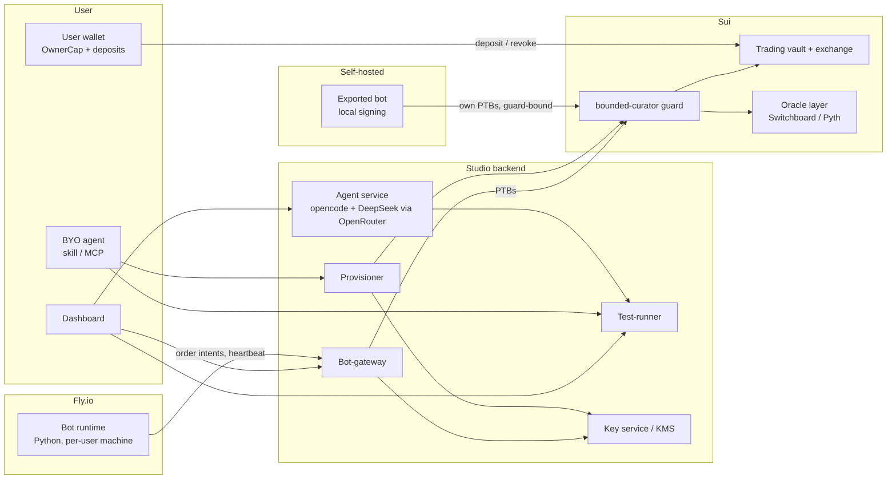

# Curator Studio — Product Specification

AI-built trading bots on the trading-vault protocol — quiz to spec to tested strategy to hosted curator, with bounded on-chain authority, an open power-user surface, and a vault marketplace as the endgame.

- **Status:** Draft v1.1, for review
- **Date:** 2026-08-11
- **Working name:** "Curator Studio" — placeholder (see Open Questions)

---

## 1. Overview

Curator Studio lets a retail user create, validate, and run an automated options-trading strategy on our trading-vault protocol without writing code. The user answers a guided quiz driven by an AI agent; the agent produces a typed, declarative **strategy spec** assembled from audited strategy primitives; the user test-drives the spec against simulation; then one click deploys a hosted bot that creates its own vault, holds a **bounded** curator capability, and trades once funds arrive.

Around that retail core, the product commits to four expansion tracks as real scope (§2.2): a guarded **bespoke-code path** for power users, **export & self-hosting** of bots and keys, a **bring-your-own-agent** surface (skill + MCP over the public APIs), and a **vault marketplace** where the best bot-run vaults attract outside depositors.

The product's core safety story is architectural, not procedural: the curator/depositor split in the trading-vault design means the bot can trade the vault but never withdraw depositor funds, and the on-chain guard bounds what even a compromised curator key can do. The user always holds the authority to revoke us. Every expansion track leans on the same property — the guard travels with the vault, whoever hosts the bot and whoever wrote the code.

**Flow in one line:** quiz → spec → test drive → deploy → vault waits for funds → bot runs strategy → dashboard monitors, iterates, or kills.

## 2. Goals & scope

### 2.1 Goals (v1 core)

- A retail user with zero coding ability goes from landing page to a live, funded, bot-curated vault in one session.
- Every strategy starts as a declarative spec built from audited primitives — auditable, versioned, regenerable.
- Every deployed spec has a simulation report attached to the exact version deployed.
- Curator authority is bounded on-chain; users hold revocation; depositors can always redeem.
- Strategy testing is an API-first service usable by the hosted agent, the dashboard, and external agents.
- Aggressive, unmissable risk disclosure with an active consent trail.

### 2.2 Committed expansion tracks (in scope)

Formerly deferred, now rolled into the spec as committed roadmap. Retail-hosted remains the launch surface; these land in phases P4–P5 (§19):

| Track | One-liner | Spec home | Phase |
|---|---|---|---|
| Bespoke strategy code | Power users graduate from primitives to LLM- or hand-written strategy code, inside a guarded pipeline | §7.4 | P4 |
| Export & self-hosting | Download your bot source, spec, and curator key; run it anywhere; the on-chain guard still binds | §10 | P4 |
| Bring-your-own-agent | Skill + MCP server so Claude Code / Cursor / any agent drives the same public APIs | §11 | P4 |
| Vault marketplace | Outside depositors discover and fund user-curated vaults; live on-chain track records only | §12 | P5 (hard-gated) |

### 2.3 Non-goals

- **Other chains.** Sui only; the Solana port is a separate effort with its own timeline.
- **General-purpose bot hosting.** We host vault-curator strategies against our protocol, not arbitrary trading code against arbitrary venues.
- **Custodial deposits.** Depositor funds only ever move via the user's own wallet into the vault; we never take deposit custody.
- **Aggressive HFT/maker strategies for retail.** Structurally gated out of the primitive library; the bespoke path (§7.4) is the only door, and it is not a retail door.
- **T4 real-data backtesting (Deribit BTC)** stays an opportunistic power-user testing mode (§13), not a commitment.

## 3. Users & core loop

**Primary launch persona:** a retail user who takes a quiz and clicks deploy. They hold assets on Sui (or want exposure to them), understand "options strategy" at the vocabulary level, and will not read code.

**Committed follow-on personas** (P4–P5): the *builder* who wants the code — bespoke strategies, exported bots, self-hosting; the *agent-native dev* who never opens our dashboard and drives everything from their own coding agent; the *depositor* who writes no strategy at all and allocates into other users' vaults via the marketplace.

**The core loop** — and the actual product — is the iterate cycle:

1. Agent quiz produces strategy spec vN.
2. User (from dashboard) or agent runs a test → immutable report pinned to spec vN.
3. Results feed back into the agent session; agent revises → spec vN+1.
4. Repeat until user accepts → active consent → deploy.

## 4. End-to-end user journey

1. **Onboard.** User signs in, connects their Sui wallet (their normal deposit wallet). Prominent, first-touch risk disclosure.
2. **Quiz.** Hosted agent session opens (opencode + DeepSeek V4 Flash 0731 via OpenRouter, in an ephemeral build sandbox). The quiz is canned-question-driven but agentic: given the wallet address, the agent inspects holdings itself and pre-fills "assets you hold." Canned dimensions: assets held, desired exposure, risk tolerance, drawdown appetite, capital to commit, tenor preference. Every risk parameter in the final spec traces to an answer the user gave.
3. **Spec.** Agent emits strategy spec v1 (§7), rendered human-readably in the dashboard beside the raw spec.
4. **Test drive.** One button. Runs the retail default simulation (§13, mode T1) over standard multi-regime windows; produces a P&L/drawdown report. User can send results back to the agent for iteration (§3). The quiz UX and this chart *are* the product.
5. **Consent.** Typed active acknowledgment ("I understand this strategy was AI-assembled, I reviewed report R on spec vN, losses are mine"). Recorded server-side: user, spec version, report ID, timestamp.
6. **Deploy.** Provisioner (§8.4) generates a curator keypair inside the key service, funds it with gas, creates the vault, wraps the curator cap in the guard, transfers the `OwnerCap` to the user's connected wallet, boots a Fly machine with the bot runtime + spec. The quiz has already told the user — repeatedly — that the curator key is not, and must never be, their deposit key; the architecture enforces it since the curator key is generated server-side and the user never handles it.
7. **Fund.** Bot idles in `WAITING_FOR_FUNDS`; user deposits into the vault from their own wallet; bot detects deposit and starts the strategy.
8. **Operate.** Dashboard shows live P&L, positions, heartbeat, and controls: pause, kill, run new test, reopen agent session, export keys (password-gated), revoke curator (via OwnerCap, from the user's wallet).
9. **Graduate (optional, P4+).** The same vault can leave the hosted path: export bot + keys and self-host (§10), switch the spec to a bespoke strategy (§7.4), or — with marketplace live — open the vault to outside depositors (§12).

## 5. Authority & custody model (decided)

Principle: **we only ever hold keys whose power is bounded on-chain, and the user always holds the thing that can revoke us.** Key secrecy is not the security boundary; on-chain constraint is.

| Tier | Held by | Powers | Storage |
|---|---|---|---|
| `OwnerCap` | User's own wallet (cold) | Rotate/revoke curator; change vault params; receives raw cap on unwrap | User's wallet. Never touches our stack. Transferred once, at vault creation. |
| `GuardedCuratorCap` | Hosted bot (hot) — or the user themselves after export | Trade only: within oracle price band, under per-epoch notional cap, on whitelisted markets | Hosted: key material in key service (KMS); signing server-side (§8.3); bot machines hold a scoped API token, never the key. Self-hosted: user holds the exported key (§10). |
| Depositor shares | Depositors | Redeem at any time — never dependent on curator liveness or honesty | — |

The custody story: *"We hold a key that can only trade within oracle-bounded prices, on a vault you can empty at any time, under an authority you can revoke from your own wallet."* Service provider, not custodian. This claim is load-bearing for legal posture (§16, §20) and must stay true in code.

**The guard is the invariant across every track.** A self-hosted bot may bypass our gateway's soft risk tier entirely — it cannot bypass the guard, because the raw cap never leaves the wrapper unless the OwnerCap holder unwraps it. Marketplace depositor protection rests on the same fact (§12).

> **Refinement adopted during design:** Hosted bots never possess key material at all. The bot submits order *intents* to the bot-gateway; the gateway builds the PTB and the key service signs it. Bot machines authenticate with a vault-scoped API token. This supersedes "KMS-encrypted key on the bot machine" — it is strictly less exposure, dissolves the restart/unseal problem, and centralizes risk enforcement. The user password gates only *export* (§8.3, §10).

## 6. On-chain: the `bounded-curator` guard package (decided)

An attachment package — core vault contracts keep their existing authority model; constraints exist only where Curator Studio creates vaults. Idiomatic Move capability-wrapping:

```move
public struct GuardedCuratorCap has key {
    id: UID,
    inner: CuratorCap,        // the real cap, locked inside — only reachable via guard functions
    policy: TradePolicy,
    spent_this_epoch: u64,    // turnover accumulator
    last_epoch: u64,
}

public struct TradePolicy has store {
    price_band_bps: u64,      // max deviation from theoretical mark (generous; anti-drain, not fair-value referee)
    max_notional_per_epoch: u64,
    allowed_markets: VecSet<ID>,
}
```

### 6.1 Mechanics

- Guard exposes mirrored entry points (`guarded_place_order`, …) that validate policy, then borrow `inner` and call real vault/exchange functions. Ownership makes enforcement free: the raw cap is unreachable except through guard functions.
- **Deny-by-default:** any curator function the guard doesn't mirror is unreachable by bots. When core gains new curator features, guarded vaults lag until the guard mirrors them. Accepted; correct failure direction.
- Sessions: bounds that are naturally aggregate (per-session turnover) check at session close, layered on the existing hot-potato invariants.
- `OwnerCap.unwrap()` extracts the raw `CuratorCap` to the owner — the full-revocation path. Note: key export (§10) does *not* unwrap; exported keys still drive the guarded cap. Unwrap is the separate, deliberate exit from the guard itself.
- Guard emits events for every policy check rejection (feeds dashboard + alerting).

### 6.2 Required core-package refactor

- Curator functions must be `public fun` (cross-package callable), not `entry`-only.
- They must take `&CuratorCap` and never assert the cap is address-owned by the tx sender.
- One audit pass enumerating *every* function gated on `CuratorCap`; explicit decision per function: mirrored or deliberately off-limits. A missed dangerous path makes the bound theater.

### 6.3 Oracle normalization (decided)

- The guard never sees an oracle type. Band checks consume the normalized `Price` produced by the core oracle abstraction — the same layer behind the existing one-PTB `allow_oracle` Switchboard/Pyth flip. **One switch, not two:** the guard must not grow its own oracle allowlist that can drift from core's.
- Staleness thresholds live in the adapter's normalization (Pyth publish-time vs Switchboard cadence differ). `TradePolicy` stays oracle-ignorant.
- Option mark for the band = BS-style theoretical from normalized spot + vol reference (BenchmarkVol-lineage). Band stays generous — its job is blocking the sell-at-1%-of-value self-trade drain. The notional-per-epoch cap is the primary damage limiter: dumb, model-free, un-gameable.

### 6.4 Upgrade policy (scheduled gate)

Guard package stays upgradeable through P4. Known trust gap: "bounded on-chain" is really "bounded unless we upgrade." With the marketplace now committed scope, the close is scheduled, not aspirational: **freezing the guard (or burning its upgrade cap) is a hard entry gate for P5** (§19) — outside depositors never fund vaults whose bounds we can rewrite. The guard is deliberately small and single-purpose so it can be frozen while everything around it iterates.

## 7. Strategy model

### 7.1 The strategy spec

Declarative, typed, human-renderable. The agent's job is filling this in from quiz answers — not writing code. Illustrative shape:

```toml
[meta]
spec_id       = "spec_9f2c"        # stable across versions
version       = 4                  # §7.3
name          = "SUI covered calls — conservative"
agent_session = "sess_ab12"

[capital]
quote_asset      = "USDC"
underlying       = "SUI"
max_deployed_pct = 80

[strategy]
primitive    = "covered_call_writer"   # audited library (§7.2) or custom module ref (§7.4)
tenor_days   = 7
target_delta = 0.20
roll_hour_utc = 14

[risk]                              # every field traces to a quiz answer
max_notional_per_epoch = "5000 USDC"   # → also written into on-chain TradePolicy
max_open_contracts     = 100
price_band_bps         = 1500          # → on-chain TradePolicy
markets                = ["SUI-USDC"]  # → on-chain TradePolicy whitelist
stop_loss_drawdown_pct = 25            # bot-level, enforced by runtime + gateway

[execution]
order_style      = "taker_limit"
max_slippage_bps = 50
```

Risk fields split into two enforcement tiers: on-chain (`TradePolicy` — survives full compromise of our stack) and gateway-enforced (softer limits like drawdown stops). The spec is the single source for both; the provisioner writes the on-chain tier at vault creation. **The `[risk]` block is mandatory for every strategy, including bespoke code** — custom logic changes what the bot decides, never what it is allowed to do.

### 7.2 Audited primitive library

Small, deliberately flow-light — retail specs should be taker or slow-quoter strategies where underlying path risk dominates fill uncertainty:

- `covered_call_writer` — hold underlying, write calls at target delta, roll at tenor.
- `cash_secured_put_writer` — quote-asset collateral, write puts at target delta.
- `delta_band_rebalancer` — maintain net delta within a band via spot/option adjustments.
- `passive_premium_seller` — slow two-sided quoting at wide, mark-referenced spreads (the most flow-sensitive primitive; gated behind stricter quiz answers).

Aggressive maker/quoting strategies are not offered to retail; the primitive library gates them out structurally. The only door to them is the bespoke path below, which is explicitly not a retail door.

### 7.3 Versioning (decided)

- Specs are versioned server-side; every edit (agent- or user-initiated) bumps the version.
- Every test report is pinned to the exact spec version it tested. Reports are immutable.
- **"Go live" requires a report on the current spec version** (hard requirement; if ever relaxed, an unmissable warning + separate consent).
- Consent records bind (user, spec version, report ID) — the paper trail (§16).
- Bespoke strategies version identically: the spec pins a content-hash of the custom module, so a code edit is a spec version bump and invalidates prior reports.

### 7.4 Bespoke strategy code (in scope · P4)

The power-user escape hatch: strategy logic written as a custom Python module against the SDK — by the user's agent (hosted or BYO) or by hand — replacing the primitive while keeping everything else in the spec. **Spec-first discipline holds even here: code is generated only after the user approves the strategy.** The flow is quiz → strategy spec → user approves → code. Guarded pipeline, every stage mandatory:

1. **Opt-in gate.** Explicit power-user acknowledgment (separate from deploy consent): AI-generated code, unaudited by us, all losses theirs. Not reachable from the retail quiz flow.
2. **Spec before code.** The quiz/agent loop produces a full strategy spec exactly as in the retail path — strategy intent plus the mandatory, user-owned `[risk]` block. The agent may propose; only the user locks it.
3. **User approves the strategy.** Explicit approval of the spec version is the trigger for code generation — no code exists before an approved spec, and the generated module implements *that* spec version. Approving a revised strategy means regenerating (or re-validating) the code against it.
4. **Authoring.** In the build sandbox (hosted agent) or anywhere (BYO/hand-written). The module implements the SDK's `Strategy` protocol for the approved spec.
5. **Static gate.** mypy `--strict` against the SDK's types; import allowlist (SDK + stdlib subset — no raw sockets, no key or signing APIs, no subprocess); lint. Fails loudly back into the agent loop.
6. **Simulation gate.** Must pass T1 multi-regime + holdout and a T2 run (§13) on the exact module hash. No report, no deploy — same rule as primitives, no exceptions for code.
7. **Runtime.** Same Fly runtime, same template scaffolding (control channel, heartbeat, modes) wrapped *around* the custom module — bespoke code cannot remove the kill switch. Same intent-only gateway path: custom code never touches keys or PTBs.

**Defense in depth, restated:** bespoke code is untrusted by construction. It runs with no key material (§5), behind gateway re-validation of every intent (§8.1), under the on-chain `TradePolicy` (§6). The pipeline gates are quality bars; the guard is the safety floor.

## 8. Backend services



### 8.1 Bot-gateway

The only path to the chain for hosted bots. Owns all the sharp logic once: PTB construction, signed-quote handling, ID resolution, oracle-object assembly.

- **API (sketch):** `POST /v1/orders` (intent: market, side, size, limit), `GET /v1/markets/{registryId}/book`, `GET /v1/vaults/{id}/state`, `POST /v1/heartbeat`, `POST /v1/control/ack`; WS channel for market data + control-plane pushes (pause/kill).
- **Server-side risk enforcement:** re-validates every intent against the deployed spec's risk tier before building the PTB. Generated or bespoke bot code cannot route around it.
- **Runtime ID resolution:** all registry/package/oracle object IDs resolved from token-info at runtime, never hardcoded — registry IDs are part of the quote-signature domain and change every redeploy; the active oracle is likewise config-resolved so a Switchboard→Pyth flip requires no bot redeploys.
- Auth: per-bot vault-scoped API tokens, issued by the provisioner, revocable independently of keys. Self-hosted bots may keep using the gateway with the same tokens (§10) — market data and risk-checked submission are conveniences worth keeping even off-platform.

### 8.2 Test-runner

API-first simulation service; the dashboard, hosted agent, and BYO agents are all thin clients of the same public API.

- **API (sketch):** `POST /v1/tests` {spec_id, spec_version, mode, window, seed} → job_id; `GET /v1/tests/{id}` → status + report; `GET /v1/reports/{id}` → immutable structured report (P&L series, max drawdown, fill stats, greeks exposure over time) + human-readable summary.
- Deterministic: seeded runs, reproducible for debugging and for the audit trail.
- **Anti-overfitting defenses (day one):** the standard eval always spans multiple regimes (chop, crash, rally windows), not one user-picked happy window; an out-of-sample holdout window the agent never iterates against, revealed only in the final pre-deploy report; the agent's system prompt explicitly warns that better backtest ≠ better strategy — the agent should be saying this to the user, because no one else in the loop will.
- Bespoke modules run in the same harness, keyed by module hash (§7.4).
- Metered per user and per API key (§17).

### 8.3 Key service

- Generates curator keypairs; key material lives only in KMS envelope encryption; signs PTBs on request from the gateway (mutual auth, per-vault authorization).
- **User password gates export only**, not operation: "fetch my keys" wraps the exported key to a user-set password, delivered via dashboard. Export consequences and post-export policy: §10.
- Every signing event logged with intent hash → append-only audit log.

### 8.4 Provisioner

The small backend the deploy button drives. One orchestration: generate keypair (via key service) → fund curator wallet with gas (deployer/gas-station lineage; fresh wallets have zero SUI — this is a hard prerequisite, and any sponsored PTBs need matching gas-station templates) → create vault + wrap cap in guard + write `TradePolicy` from spec → transfer `OwnerCap` to user wallet → issue bot API token → boot Fly machine with runtime image + spec → register vault with dashboard. Also owns teardown, gas top-up monitoring, and (P4) the export flow and BYO-initiated deploys — with consent always confirmed by the user directly, never by their agent (§11, §16).

### 8.5 Agent service

- Hosted coding-agent sessions: opencode + DeepSeek V4 Flash 0731 through OpenRouter, in ephemeral build sandboxes (minutes-scale lifetime). Build sandbox (untrusted AI output) and run sandbox (holds API token) are architecturally separate — opposite trust profiles.
- **Sessions are resumable and long-lived logically:** session state (transcript, current spec, report refs) persists in our backend keyed to the vault/spec, rehydrated into a fresh sandbox on reopen. Required for the dashboard→test→"send results back to agent" loop; in scope from v1.
- Agent tools: wallet inspection (read-only holdings for the quiz), spec read/write, test-runner client, primitive-library docs; P4 adds the bespoke-code authoring tools (§7.4). Hard-scoped system prompt (§17).
- The hosted agent is one client of the public APIs — deliberately at parity with BYO agents (§11), so the two paths never fork the backend.

### 8.6 Bot runtime hosting

- Fly.io machines, one per bot: always-on tiny VM, per-app isolation, cheap at idle. (Railway/Render acceptable substitutes; serverless is a non-fit for a long-running trading loop.)
- Machine env: bot API token, gateway URL, spec. No key material ever (§5).
- Lifecycle: provisioner creates/destroys; gateway detects missed heartbeats and can restart via Fly API.

## 9. Python SDK & bot template

- **SDK = typed thin client over the bot-gateway** (decided: gateway first, SDK wraps it). No PTB logic in Python; simple enough that a cheap model uses it correctly. Fully type-annotated, mypy `--strict` enforced in CI.
- **Types encode risk invariants, not just shapes:** every order constructor requires a `RiskLimits` object derived from the spec; there is no API to place an order without one.
- **Template scaffolding (non-negotiable, outside the strategy loop):** control channel listener — pause/kill works even if the strategy loop is wedged; heartbeat to the gateway; `WAITING_FOR_FUNDS` state watching for vault deposits; mode switch `paper | live` — same strategy code, gateway-simulated fills in paper mode.
- Strategy primitives ship in the SDK as audited classes; the template binds a spec to either a primitive or (P4) a custom `Strategy` module. Bespoke code slots inside the scaffolding; it cannot replace it (§7.4).
- **Published publicly (PyPI) at P4** to serve self-hosters and BYO agents. Adds a `local-signing` mode for exported keys (§10): the SDK gains client-side PTB construction for the guarded entry points, or drives the gateway's build-only endpoint — either way the guard binds. The SDK + template + docs are the substance of the BYO-agent skill/MCP (§11): one agent-facing surface, "construct, test, deploy a strategy," against the same public APIs.

## 10. Export & self-hosting (in scope · P4)

Hosted-first is a starting posture, not a lock-in. Any vault can leave.

### 10.1 What export delivers

- **Bot source:** the template + the vault's strategy (primitive binding or bespoke module) + current spec, as a runnable repo.
- **Curator key:** from the key service, wrapped to a user-set password (§8.3). The dashboard walks the user through it; the quiz-era warning returns here with force: this key must never be their deposit key, and now *they* are responsible for it.
- **Continuity:** the vault, guard, OwnerCap, spec history, and reports are all unchanged. Export moves operation, not authority.

### 10.2 Post-export key policy (decided)

**Export ends hosted signing.** On export completion the key service revokes its signing authorization for that vault and the hosted bot (if any) is stopped. Two parties silently sharing one hot curator key is the worst of both worlds — split brain on nonces and accountability. Users who want to return to hosting re-onboard: we generate a *fresh* curator key and the user rotates it in via OwnerCap.

### 10.3 Self-hosted operation

- Bots sign locally with the exported key. They may still use the gateway (market data, risk-checked submission, heartbeat/alerting) with their API token — recommended, not required.
- A self-hosted bot that skips the gateway loses the soft risk tier (drawdown stops, intent re-validation). **Accepted:** the on-chain `TradePolicy` still binds — this is exactly the scenario the guard exists for. Dashboard marks the vault "self-hosted: on-chain limits only."
- Support posture: SDK, docs, and template are supported; the user's infrastructure is not. Heartbeat-based dashboard monitoring degrades gracefully to on-chain observation.

## 11. Bring-your-own-agent (in scope · P4)

For users whose coding agent (Claude Code, Cursor, anything MCP-capable) is already where they work. We meet them there instead of making them use our hosted sandbox.

- **Packaging: both a skill and an MCP server** over the same public APIs — the MCP server exposes typed tools (spec CRUD, test-runner submit/fetch, wallet inspection, provisioner deploy, docs search); the skill is the thin instruction layer teaching an agent the construct→test→deploy workflow. Small build by design: the SDK, docs, and public APIs already exist; this is a client.
- **Auth: user-scoped API keys**, issued from the dashboard, metered (§17) — same metering plumbing as the hosted sandbox.
- **The BYO agent runs its own test loop** — it calls the test-runner directly and iterates without our dashboard in the loop (our hosted service remains available; the agent just doesn't need it).
- **Consent is never delegable to an agent.** Deploy and go-live consent (§16) always complete out-of-band from the agent: a dashboard confirmation, or a wallet-signed approval referencing (spec version, report ID). An MCP tool can *request* deploy; only the human can grant it. This is the one deliberate break in API parity.
- Parity rule: anything the hosted agent can do, a BYO agent can do (except operate our sandbox). Enforced by making the hosted agent itself a client of the public APIs (§8.5).

## 12. Vault marketplace (in scope · P5, hard-gated)

The endgame: every user is a curator, and the best bot-run vaults attract outside depositors. Committed scope — with hard prerequisites, because this is the step where strangers' money enters.

### 12.1 Entry gates (all mandatory before GA)

- **Guard package frozen** (upgrade cap burned or package immutable, §6.4). "Bounded on-chain" must not carry an "unless we upgrade" asterisk when depositors are strangers.
- **Legal review completed** (§16, §20) — the managed-money posture question is categorically harder here; launch geography may be gated.
- **Live track records only:** marketplace display is built exclusively from on-chain vault history (deposits, fills, redemptions, P&L). Backtest and simulation results are never shown on marketplace listings — reports are an iteration tool, not marketing material.

### 12.2 Product surface

- **Discovery:** browsable listings — strategy category (from the spec's primitive; bespoke vaults labeled as such), live P&L and drawdown, TVL, age, curator hosting status (hosted vs self-hosted), guard policy summary (band, cap, markets — the depositor's actual protection, surfaced as a first-class feature).
- **Depositor journey:** browse → vault detail (live history, policy, risk disclosures) → depositor-grade consent (§16) → deposit from own wallet → monitor via depositor dashboard view → redeem any time. Depositors never interact with the bot, the agent, or the curator's keys.
- **Curator opt-in:** vaults are private by default; listing is an explicit curator action with its own acknowledgment (public track record, fee obligations, listing standards).
- **Fees:** curator fee split (management/performance) — parameters and our platform take are open (§20); mechanically, fees accrue at the vault layer where the ledger-share accounting already lives.

### 12.3 Depositor protection model

Same three pillars, now protecting strangers: redemption never gated on curator liveness or honesty; the frozen guard bounds worst-case curator behavior (including a malicious curator — the self-trade drain analysis of §15 is exactly the depositor's threat model); the OwnerCap holder can revoke a compromised curator, and depositors can always walk. Marketplace adds: guard-rejection events and policy parameters surfaced on the public vault page.

## 13. Strategy testing ladder

Four modes in the service; **retail sees one button.** "Test drive" = T1 under the hood. The full ladder is SDK/power-user surface, and the whole ladder is reachable by BYO agents via the public API.

| Mode | What it is | Data | Status |
|---|---|---|---|
| T1 · Replay sim | Real SUI spot history replayed; options marked theoretically (BS off realized vol / BenchmarkVol); taker arrivals as calibrated Poisson flow. Tests the thing that kills option strategies — the underlying path. **Retail default.** | Real underlying, synthetic derivative layer | v1 |
| T2 · Live simulated flow | Bot in paper mode against staging with market-sim generating flow. Near-zero incremental build — this environment already exists. | Live synthetic | v1 |
| T3 · Shadow mode | Paper bot against real production flow with counterfactual fills: we run the venue and see every quote and fill, so "would my quote have won?" is answerable exactly — shadow quote fills iff it beats the actual winner. Better paper-trading signal than tradfi RFQ desks get. Known accepted limitation: no flow-feedback modeling (noise at our scale). Final pre-launch gate for flow-sensitive and bespoke strategies. | Live real | P4 |
| T4 · Real-data backtest | Deribit BTC options replay — validates strategy logic across regimes; wrong underlying + wrong venue mechanics, so power-user only. Opportunistic, uncommitted (§2.3). | Historical real (BTC) | uncommitted |

## 14. Dashboard

Operated, not read. Surfaces per vault/bot:

- **Status:** bot state (waiting / running / paused / dead / self-hosted), heartbeat freshness, live P&L, positions, greeks, vault TVL, guard-rejection events.
- **Controls:** pause / resume; **kill switch** (separate control channel — must work when the strategy loop is wedged: gateway stops accepting intents AND pushes control-plane kill AND can hard-stop the Fly machine); run test (mode T1; full ladder for power users); reopen agent session with results attached ("send to agent" injects the report ID; agent fetches structured JSON — no lossy pasting); export bot + keys (password-gated, §10); revoke curator — deep-link to an OwnerCap `unwrap` transaction signed from the user's own wallet; issue/revoke BYO API keys (§11); list vault on marketplace (P5, curator opt-in, §12).
- **Records:** spec version history, test reports, consent receipts, signing audit log.
- **Depositor view (P5):** the curator and depositor views formally diverge at marketplace launch — depositors get live history, policy summary, their share position, and redeem; nothing operational.

## 15. Security & threat model

| Threat | Mitigation |
|---|---|
| Curator key stolen → self-trade drain (sell at garbage price, fill from attacker account) | The central design driver. On-chain guard: oracle-referenced price band + per-epoch notional cap + market whitelist. Stolen key ⇒ bounded slippage per epoch, not the vault. |
| Our stack fully compromised | On-chain `TradePolicy` tier survives; depositors can always redeem; user's OwnerCap (never on our stack) revokes the curator. |
| AI-assembled strategy loses money "buggily" | Retail: specs over audited primitives only; typed SDK; gateway re-validates every intent; drawdown stop; mandatory test drive. |
| Bespoke strategy code is malicious or buggy | §7.4 pipeline: opt-in gate, static gate (mypy --strict, import allowlist — no key/signing/network APIs), mandatory sim reports on the module hash. Then defense in depth: no key material on the machine, gateway intent re-validation, on-chain policy floor. Code changes decisions, never permissions. |
| Bot machine compromised | Holds only a vault-scoped API token — no keys. Token revocable independently. Gateway rate-limits and risk-checks all intents. |
| Exported key mishandled by self-hoster | Export is password-gated, ends hosted signing (no shared hot key, §10.2), and hands over a *guarded* cap: the on-chain policy still bounds the key the user now protects. Dashboard flags the vault "on-chain limits only." |
| BYO agent deploys without the user's real consent | Consent is structurally non-delegable: deploy completes only via dashboard confirmation or wallet-signed approval bound to (spec version, report ID) — an agent can request, never grant (§11). |
| Malicious marketplace curator gaming depositors | Frozen guard (P5 gate) bounds worst-case behavior incl. self-trade extraction; live-on-chain track records only (no backtest marketing); always-on redemption; policy parameters public on the listing (§12). |
| Guard upgrade abuse (us or a compromise of us) | Accepted gap through P4 (§6.4); freezing the guard is a hard P5 entry gate — closed before strangers' deposits arrive. |
| Agent sandbox abused as free general-purpose LLM | §17: hard-scoped prompt, per-user OpenRouter spend metering, ephemeral sandboxes. |
| Overfit specs (agent-assisted curve fitting) | Multi-regime standard eval + out-of-sample holdout + seeded determinism + agent-prompt warnings (§8.2). Marketplace never displays sim results (§12.1). |
| User funds keys wrongly (deposit key = curator key) | Structurally impossible in hosted flow: curator keys are generated server-side; the user never handles them. The rule is re-taught with force at export (§10.1), where it becomes the user's responsibility. |
| Oracle flip drift (core on Pyth, guard demanding Switchboard) | Single source of truth: guard consumes core's normalized price; no second allowlist. Gateway resolves active-oracle IDs at runtime. |

## 16. Consent, disclaimers & compliance

- **Disclosure is everywhere and unmissable:** this is an AI-assembled strategy; we are not responsible for losses from a bad strategy; past/simulated performance is not predictive. On landing, in the quiz, on every report, at deploy.
- **Active consent, not banner text:** typed acknowledgment at deploy, recorded server-side binding (user, spec version, report ID, timestamp). The quiz structure itself is evidence: every risk parameter traces to a decision the user demonstrably made.
- **Consent ladder for the expansion tracks:** bespoke code adds a separate power-user acknowledgment (§7.4); export adds a key-responsibility acknowledgment (§10.1); BYO deploys require out-of-band human confirmation — agents cannot consent (§11); marketplace adds depositor-grade disclosures on every listing and a curator listing acknowledgment (§12).
- **Honest internal posture:** when we build the strategy, host the bot, and hold the key, disclaimers alone are thin armor. The real defenses are architectural — user-held OwnerCap, bounded curator, always-on redemption — plus the consent trail. Legal review of the custody/managed-money posture is a launch blocker (§20) and is categorically harder for the marketplace, where it is a P5 entry gate (§12.1).

## 17. Abuse control & metering

- Build sandboxes: ephemeral (minutes-scale), hard-scoped system prompt (quiz/spec/test tools only; bespoke authoring tools behind the P4 opt-in), per-user OpenRouter spend budget with cutoffs, session count limits.
- Test-runner: per-user and per-API-key run metering and rate limits (sim runs cost real compute) — one metering plane serves the hosted sandbox, the dashboard, and BYO keys.
- Gateway: per-bot rate limits on intents; anomaly alerts on rejection storms.
- BYO API keys: dashboard-issued, scoped, individually revocable, budgeted (§11).

## 18. Observability & ops

- House alerting convention applies: every service tx-submission failure logs `error!(alert_id = "tx-failed-…")` at the service handler, benign race-losses suppressed. New alert families: missed-heartbeat (bot dead), guard-rejection storm, curator gas low (provisioner tops up), OpenRouter/sim spend anomalies, signing-service errors.
- Bot heartbeats → gateway → alert + auto-restart via Fly API; restart loops page a human. Self-hosted vaults degrade to on-chain observation (§10.3).
- Signing audit log (§8.3) and consent records are append-only.
- Redeploy discipline: nothing anywhere hardcodes registry/package/oracle IDs; token-info is the single source (existing rule, now enforced across gateway, provisioner, test-runner).

## 19. Build order

| Phase | Scope | Gate to next |
|---|---|---|
| P0 · Contracts | Core refactor for wrappability (public fun, `&CuratorCap`, surface audit) · `bounded-curator` guard · oracle-normalization dependency · OwnerCap wrap/unwrap flows | Guard holds on staging: self-trade drain attempt blocked by band; notional cap enforced; unwrap works from user wallet |
| P1 · Trading spine | Bot-gateway · key service (KMS + server-side signing) · provisioner (gas funding, vault creation, Fly boot) · SDK + template · 2 primitives | We dogfood: a hand-written spec runs a hosted bot on a guarded staging vault end-to-end |
| P2 · Testing | Test-runner: T1 (replay sim) + T2 (staging/market-sim) · report artifacts · spec versioning · multi-regime windows + holdout | Deterministic reports pinned to spec versions; dogfood specs iterate via reports |
| P3 · Retail product | Dashboard · agent service (quiz, resumable sessions, wallet inspection) · consent flow · abuse metering · Test-drive button | Private beta: retail testers go quiz→deploy unassisted; kill switch and revoke drills pass |
| P4 · Power-user surface | Bespoke-code pipeline (§7.4) · export & self-hosting incl. post-export key revocation (§10) · SDK to PyPI + local-signing mode · BYO skill + MCP server + API keys (§11) · T3 shadow mode | A BYO agent constructs, tests, and (human-consented) deploys a bespoke strategy; an exported bot trades self-hosted under guard bounds; hosted signing provably revoked on export |
| P5 · Marketplace | Listings + discovery · depositor journey + depositor dashboard view · curator opt-in + fees · live-track-record data plane (§12) | **Entry gates, not exit:** guard package frozen · legal review passed · live-data-only display enforced. GA when depositor drills (redeem under dead curator, revoke under malicious curator) pass on staging |

## 20. Open questions

1. **Monetization.** Candidates: management/performance fee at the vault layer, hosting subscription, sim-compute pass-through, marketplace platform take. Fee-taking changes the legal posture — decide together with #2. The marketplace fee split (curator vs platform) is now part of this question.
2. **Legal review of custody/managed-money posture.** The bounded-authority story is the defense; needs professional review before public launch, and again — harder — as a P5 entry gate for the marketplace. Includes jurisdiction gating/geofencing.
3. **Guard freeze mechanics.** Timing is decided (P5 entry gate, §6.4); remaining: freeze mechanism (burn upgrade cap vs immutable republish) and whether existing vaults migrate or grandfather.
4. **Mark-model detail for the band.** Which vol reference on-chain, how stale-tolerant, band width per market. Coarse v1 is fine (notional cap is primary), but numbers need picking.
5. **Model check.** Is DeepSeek V4 Flash strong enough for quiz + spec-filling (v1) — and later for bespoke codegen (P4), which is a much higher bar? Evaluate before P3 and again before P4; OpenRouter makes swapping trivial.
6. **Epoch definition** for the notional cap (Sui epochs ≈ 24h vs custom windows).
7. **Bespoke-code sandbox depth (P4).** Is the import allowlist + no-keys + gateway + guard stack sufficient, or do bespoke modules also get seccomp/network-egress isolation on the Fly machine? Decide during P4 design.
8. **Marketplace listing standards (P5).** Minimum vault age / track length before listing; how bespoke-code vaults are labeled; delisting policy.
9. **Naming.** "Curator Studio" is a placeholder.

## 21. Decision log

| # | Decision |
|---|---|
| D1 | Retail-first: the launch user takes a quiz and clicks deploy. Power-user tracks follow in P4–P5, not v1. |
| D2 | Every strategy starts as a declarative spec over audited primitives; bespoke code is a gated P4 path, never the retail default. |
| D3 | AI provenance + no-liability disclosure all over the product; active typed consent recorded with spec version + report ID. |
| D4 | Bot-gateway service first; Python SDK is a typed wrapper over it. Server-side risk enforcement at the gateway. |
| D5 | Three-tier authority: user-held OwnerCap · bounded hot CuratorCap · always-on depositor redemption. |
| D6 | Bounds implemented as an attachment (`bounded-curator` wrapper package); core contracts reorganized only as needed for wrappability; constraints exist only on Curator Studio vaults. |
| D7 | Guard stays upgradeable through P4; freezing it is a hard P5 (marketplace) entry gate. |
| D8 | Deny-by-default feature lag accepted: guarded vaults use new curator features only once the guard mirrors them. |
| D9 | Oracle-agnostic guard: consumes core's normalized price; Switchboard↔Pyth flip stays one switch; gateway resolves oracle IDs at runtime. |
| D10 | Bot creates its own vault and holds the (wrapped) curator cap; OwnerCap transferred to user at creation; no cap-transfer ceremony. |
| D11 | Hosted bots never hold key material: server-side signing via key service; user password gates export only. |
| D12 | Testing is an API-first service; dashboard, hosted agent, and BYO agents are all thin clients; dashboard-initiated results can be sent back into the (resumable) agent session. |
| D13 | Test ladder T1–T4; retail sees a single Test-drive button (T1); reports immutable and pinned to spec versions; go-live requires a current-version report. |
| D14 | Anti-overfitting defenses from day one: seeds, multi-regime standard eval, out-of-sample holdout, agent-prompt warnings. |
| D15 | Hosting: Fly.io machines for run-time bots; ephemeral separate sandboxes for build-time agent (opencode + DeepSeek V4 Flash 0731 via OpenRouter). |
| D16 | Kill switch + heartbeat are non-negotiable template scaffolding on a control channel separate from the strategy loop; bespoke code cannot remove it. |
| D17 | **Scope expansion (v1.1):** bespoke code, export/self-hosting, BYO-agent, and the vault marketplace move from non-goals to committed scope (P4–P5), each with its own spec section, consent tier, and threat-model entries. |
| D18 | Bespoke code changes decisions, never permissions — and is spec-first: quiz → strategy spec → user approves → code. Mandatory `[risk]` block, static + simulation gates on the module hash, no key/signing APIs reachable, gateway + guard unchanged beneath it. |
| D19 | Export ends hosted signing: key service authorization revoked at export; no shared hot keys; re-hosting means a fresh key rotated in via OwnerCap. |
| D20 | Consent is never delegable to an agent: BYO deploys complete only via dashboard confirmation or wallet-signed approval bound to (spec version, report ID). |
| D21 | Marketplace displays live on-chain track records only — simulation/backtest results never appear on listings. |
